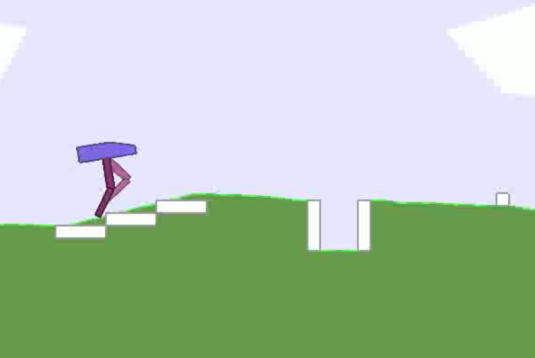
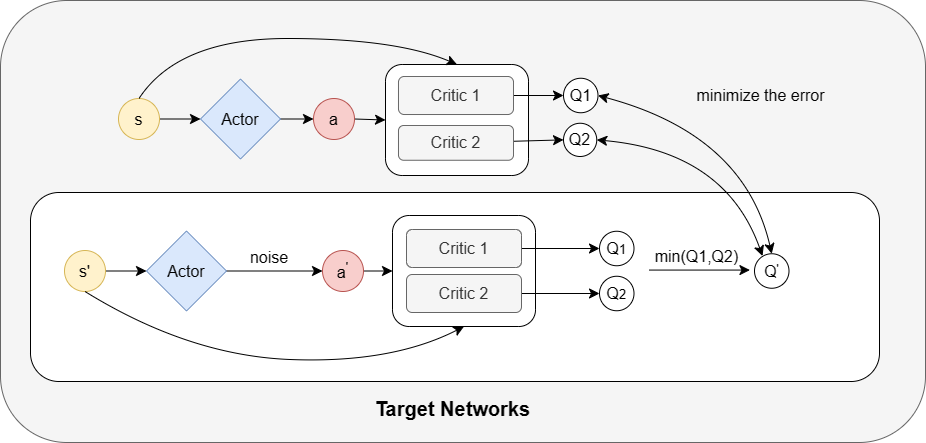
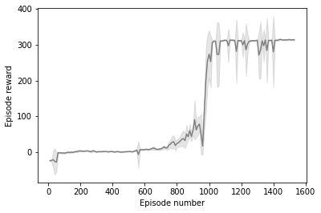
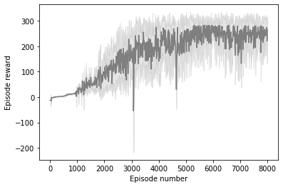

# Application-of-TD3-algorithm-in-the-BipedalWalker-environment
This paper aims to apply the twin-delayed deep deterministic policy gradient algorithm for learning to walk in both the BipedalWalker v3 and BipedalWalker v3 hardcore environments.

[code](https://colab.research.google.com/drive/1bL43tarBXXOvd87xWmyNTblRk-SFdK62?authuser=1)
[paper](RL_report.pdf)  

## Method

  
## normal results
[Video](https://youtu.be/2vCyfc7E3-Y)  
  

  
## 3.Hardcore results
[Video](https://youtu.be/Y8IWGL4k29Y)
  

